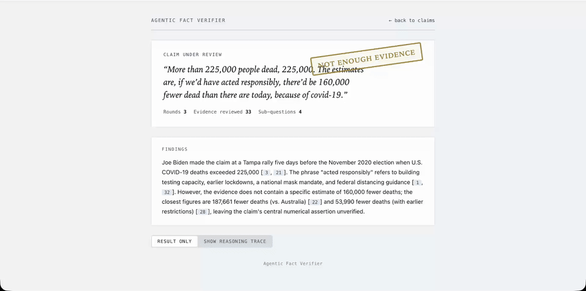
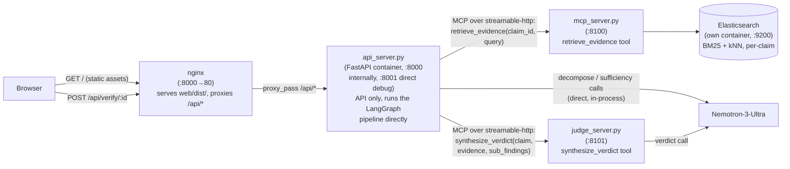
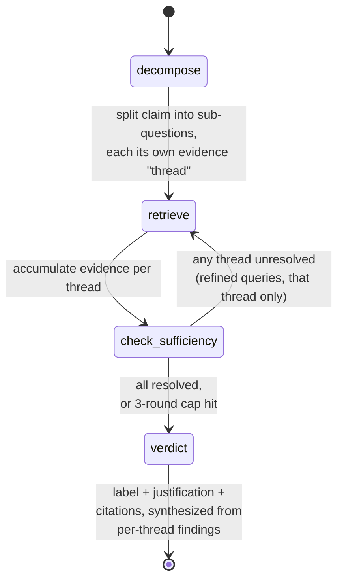

# Agentic Fact Verifier

A general-purpose agentic fact-verification system: given a claim, it
decomposes the claim into sub-questions, retrieves evidence per sub-question,
dynamically decides whether it has enough evidence (re-querying with refined
searches if not), and produces a verdict with citations traceable back to the
exact evidence and sub-question they came from.



## Architecture

### Tech stack

- **LangGraph**, orchestration; the verification pipeline is an explicit state machine, so retrieval rounds and control flow are decided dynamically per sub-question.
- **RAG (Retrieval-Augmented Generation)**, the core pattern: every verdict is grounded in retrieved evidence with per-claim citations.
- **MCP (Model Context Protocol)**, exposes retrieval and verdict synthesis as standard tools.
- **Elasticsearch**, hybrid BM25 + kNN retrieval powering the RAG layer.
- **LangSmith**, observability: traces every LLM call and graph step end-to-end, so a verification run is full reasoning chain.
- **FastAPI**, the API tier.
- **TypeScript + Vite**, the frontend.
- **Nginx**, reverse proxy; serves the built frontend and routes to the API tier.
- **Docker Compose**, local orchestration across all five services.

### Deployment topology



### Verification state machine


## Usage

### Prerequisites

- **Docker**
- **Python 3.12 + uv**, only needed to run the
  one-time indexing scripts below (`setup_es_index.py` / `ingest_knowledge_store.py`).

### Running against AVeriTeC (the default dataset)

**1. Get the AVeriTeC dev split.** Download `chenxwh/AVeriTeC` from
[Hugging Face](https://huggingface.co/chenxwh/AVeriTeC) (see that repo's own
instructions for cloning/downloading). You need two things
out of it:
- the dev-split claims JSON → save as `data/raw/dev.json` (500 claims + gold labels)
- the dev-split knowledge store → extract to `data/knowledge_store/dev/`
  (one JSON file per claim; the archive typically unpacks to a folder named
  `output_dev`, rename it to `dev`)

`docker-compose.yml` mounts `./data` into the app container read-only, so this
data lives on the host either way, no need to copy it anywhere else.

**2. Configure environment.** Create `.env` in the repo root:

```
FIREWORKS_API_KEY=...
# optional — LangSmith tracing
LANGSMITH_TRACING=true
LANGSMITH_ENDPOINT=https://eu.api.smith.langchain.com
LANGSMITH_API_KEY=                            # a Service Key
LANGSMITH_PROJECT=agentic-fact-verifier

# dataset config, defaults shown below already match AVeriTeC, so leave
# these as-is unless following "Using a different dataset" below
ES_INDEX_NAME=averitec_dev_chunks
VERDICT_LABELS=Supported,Refuted,Not Enough Evidence,Conflicting Evidence/Cherrypicking
```

**3. Start the stack:**

```bash
docker compose up -d --build
```

This builds and starts all five services: `elasticsearch`, `mcp_server`
(retrieval, port 8100), `judge_server` (verdict synthesis, port 8101),
`api_server` (API only, port 8001 for direct debugging), and `nginx` (port 8000,
the actual entry point; serves the built frontend and proxies `/api/*` to
`api_server`). Optionally add `--build-arg BAKE_MODEL_WEIGHTS=true` to pre-fetch
the embedding model at build time instead of on `mcp_server`'s first request
(bigger image, no first-request download).

**4. Build the search index and ingest the knowledge store:**

```bash
uv run scripts/setup_es_index.py                     # creates the ES_INDEX_NAME index
uv run scripts/ingest_knowledge_store.py --limit 2    # smoke-test the mechanism first
uv run scripts/ingest_knowledge_store.py              # full run, all 500 claims
```

The **full run genuinely takes hours**, measured at ~235 chunks/sec on real
data, ingesting all 500 claims takes roughly **12–20
hours**.

The script skips already-indexed claims, so it's safe to interrupt and resume
(picks up where it left off, including after the `--limit 2` smoke test above).

**5. Verify a claim.** Open `http://localhost:8000`, pick a claim, watch it run
live, decomposition, retrieval rounds, sufficiency checks, and the final
verdict with clickable citations back to the exact evidence.

### Using a different dataset

1. **Write an ingestion script for your data's format**, adapted from
   `ingest_knowledge_store.py` (its parsing of AVeriTeC's own JSON schema is
   inherently dataset-specific, every dataset needs its own version of this
   step). It just needs to write documents shaped like
   `{claim_id, url, text, embedding, ...}` into Elasticsearch, one chunk per
   passage, `claim_id` matching whatever ID your claims use.
2. **Set `ES_INDEX_NAME`** in `.env` to a new index name for new dataset.
3. **Set `VERDICT_LABELS`** in `.env` to new dataset's own label taxonomy
   (comma-separated), if it differs from AVeriTeC's four-way one.
4. **Run `setup_es_index.py`** (it reads `ES_INDEX_NAME`, so this creates new
   new index) **then run ingestion script.**
5. **Point the claim picker at your data**: `api_server.py` currently reads
   `data/raw/dev.json` and a hardcoded `CURATED_CLAIM_IDS` list for the `/api/claims`
   picker, swap in new claims file and ID list.

Nothing else needs to change, `docker compose up -d --build` and the rest of
Setup above work identically once the two env vars point at your data.